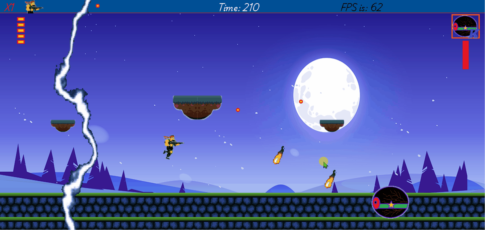

## Hero Reborn

Hero Reborn is a classic-style 2D shooting game developed in C++ with SDL2, 
where players fight enemies and bosses to reclaim conquered lands.


---
## 🎮 Demo Gameplay




---
#### Key Features

🧍 Smooth movement, jumping, and shooting with responsive effects

🤖 Enemies use AI to move and attack autonomously

🌋 Tile-based maps with cliffs, complex terrain, and traps

💥 Enemy death effects, boss flash effects, and character revival

🎵 Dynamic background music and sound effects

🧠 Fully object-oriented programming structure used throughout the project


---
## System Requirements

- Operating System: Windows or Linux  
- Required Libraries: SDL2, SDL_image, SDL_mixer, SDL_ttf
- Compiler: g++ or Visual Studio


---
## How to Run

### Option 1: Run from Source

```bash
git clone https://github.com/BomXanhGZ/GAME-SDL2-DEMO.git
cd GAME-SDL2-DEMO
make
./bin/hero_reborn 
```

### Option 2: Install and Setup File
Install Link https://drive.google.com/file/d/1gOQ-0UT4RdoMCFiCEgbQacDJ-3YOqedU/view?usp=drive_link


---
## Author

Name: DO THIEN HAO 
Pen name: BomXanhG-Z! 
GitHub: https://github.com/BomXanhGZ 
Email: haodo2805@gmail.com 


---
## License

This project is released for free for educational and non-commercial purposes.
